# Req 1. 프라이빗 이더리움 네트워크 구축

## Req 1-1. 가상 머신 구성

**VirtualBox 설치**

**Vagrant 설치**

- vagrant 설치 여부 및 버전 확인

```
vagrant version
```


- 호스트와 가상 머신 간 파일 전송 플러그인 설치

```
vagrant plugin install vagrant-scp
```


**이더리움 네트워크 구축용 VM 2대 생성 - VM name: eth0, eth1**

가상 머신 생성 및 구동

- 원하는 작업 디렉토리에서 Vagrant 초기화(설정 파일 생성)

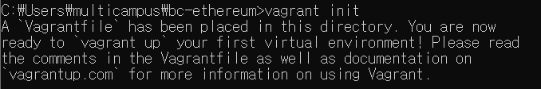


- 생성된 Vagrantfile의 내용 수정

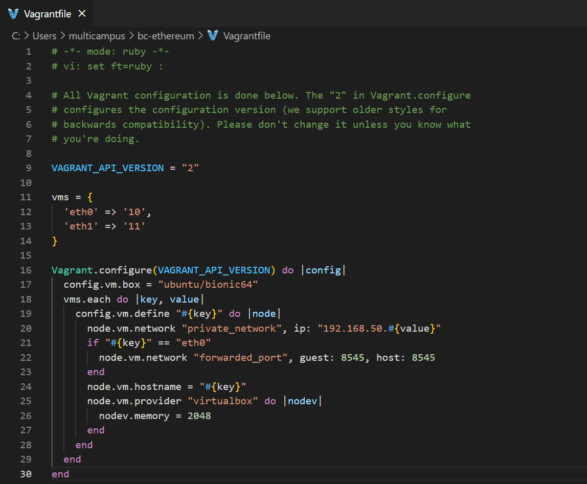


- 가상 머신 구동 명령어 실행

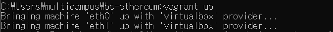


- 가상 머신 구동 상태 확인

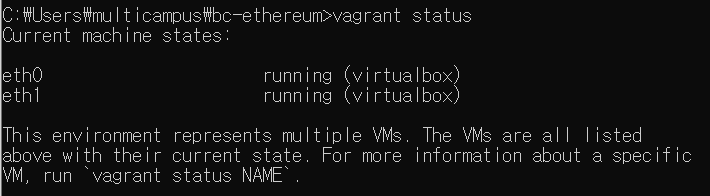


- 가상 머신 접속(eth0 기준)

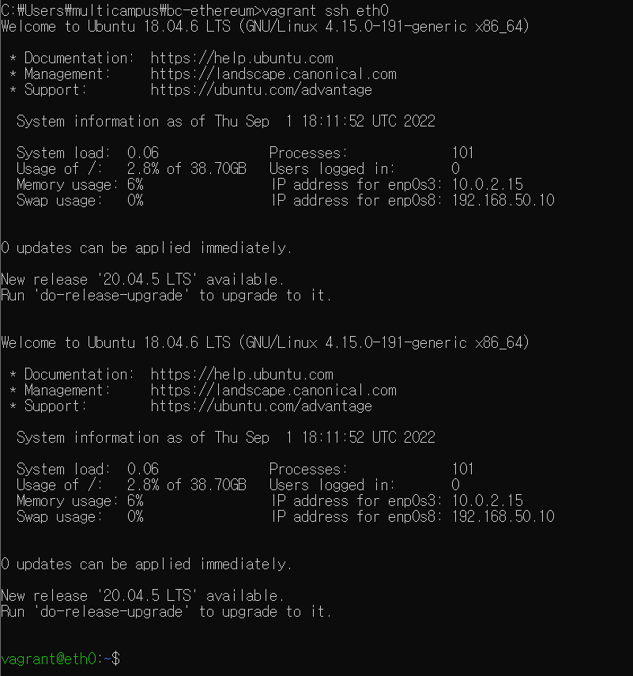


## Req 1-2, 1-3. 이더리움 eth0, eth1 노드 구성

**이더리움 소프트웨어는 Geth1.9(stable) 이상을 사용**

**Geth는 가상 머신 상에서 동작하도록 구축**

**eth0 노드의 경우 RPC API를 호출할 수 있도록 활성화**


- 각 가상머신에 geth 설치

```
sudo apt-get update
sudo apt-get install software-properties-common
sudo add-apt-repository -y ppa:ethereum/ethereum
sudo apt-get install ethereum
geth version
```


- 디렉토리 생성 및 genesis 블록파일 생성

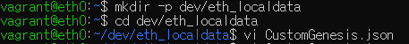


- CustomGenesis.json

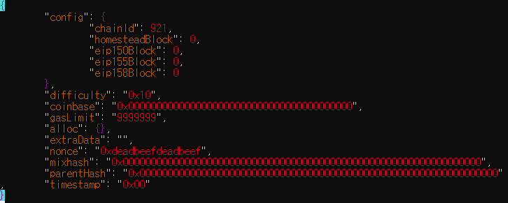


- Geth 초기화

```
geth --datadir /home/vagrant/dev/eth_localdata init /home/vagrant/dev/eth_localdata/CustomGenesis.json
```


- 초기화 후 확인 위해 tree 설치

```
sudo apt install tree
tree
```


- eth0 노드 설정

```
geth --networkid 921 --maxpeers 2 --datadir ~/dev/eth_localdata --allow-insecure-unlock --port 30303 --http --http.port 8545 --http.addr 0.0.0.0 --http.corsdomain "*" --http.api "admin,net,miner,eth,rpc,web3,txpool,debug,personal" --miner.threads 1
```

```
geth attach http://0.0.0.0:8545
```


- eth1 노드 설정

```
geth --networkid 921 --maxpeers 2 --datadir ~/dev/eth_localdata --allow-insecure-unlock --port 30303 --http --http.port 8545 --http.addr localhost --http.corsdomain "\*" --http.api "admin,net,miner,eth,web3,txpool,debug,personal" --miner.threads 1
```

```
geth attach http://localhost:8545
```


# **Req 2. 이더리움 계정 생성**

## Req 2-1. 이더리움 계정 생성

**사용자 계정은 노드마다 최소 1개 이상 생성**

**계정 생성에 따른 keystore 파일 확인**

```
personal.newAccount("password")
```

```
cd dev/eth_localdata/keystore/
ls
```


**문제**

eth.accounts 했을 때 계정이 각자 나옴

**미해결**


## Req 2-2. 코인베이스(Coinbase) 설정

**코인베이스: 블록 생성에 따른 보상금 지급 계정**

**노드마다 생성한 계정 중 하나를 코인베이스로 설정**

```
 eth.coinbase
 miner.setEtherbase(eth.accounts[0])
```


## Req 2-2. 마이닝(Mining) 시작

**모든 노드에서 마이닝 시작**

**마이닝 진행 상태 확인**

**일정량 마이닝 진행 후 중단**

```
miner.start(1)
eth.mining
miner.stop()
```


## Req 2-3. 마이닝(Mining) 결과 확인

**계정별 잔액 확인**

**생성된 블록 수 조회**

**블록의 상세 정보 조회**

```
eth.getBalance(eth.accounts[0])
eth.blockNumber
eth.getBlock(eth.blockNumber)
```

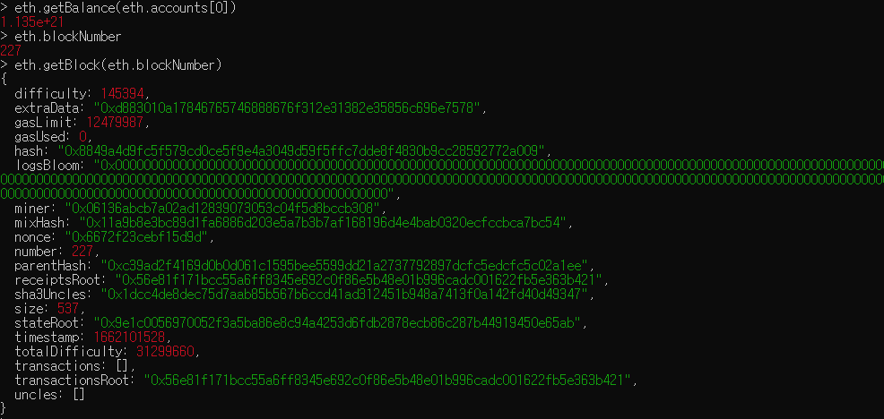


# Req 3. 이더리움 트랜잭션 생성

## Req 3-1. 트랜잭션 생성

**계정 간 이더 전송 트랜잭션 생성**

**전송할 이더량은 임의로 지정**

**트랜잭션 해시 값 확인**

**트랜잭션 상태 조회**

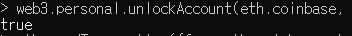

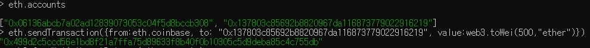


## Req 3-2. 트랜잭션 결과 확인

**마이닝 재시작**

**트랜잭션 상태 조회**

**마이닝에 따른 트랜잭션 처리가 완료되면 마이닝 중단**

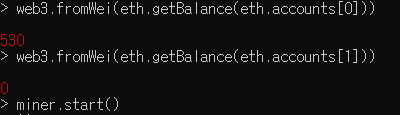

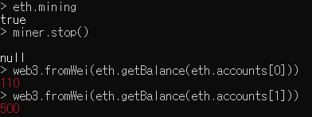


# **Req 4. 스마트 컨트랙트 배포**

## Req 4-1. eth0 노드 확인

**VirtualBox 또는 Vagrant 에서 eth0 VM에 대한 포트 포워딩 확인 - Host 8545 -> Guest 8545**

**eth0의 keystore를 json 파일로 저장**

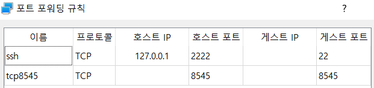

**keystore란?** 이더리움 Private Key을 암호화한 파일

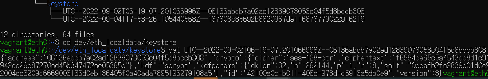

> tree로 파일 이름 확인 후 cat으로 파일 확인


## Req 4-2. Metamask 설정

**Metamask에서 계정 Import(eth0의 keystore json 파일 가져오기)**

**Metamask에서 계정 및 잔액 정보 확인**

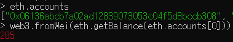

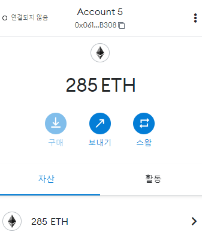


## Req 4-3. 스마트 컨트랙트 배포(Remix)

**Remix 접속**

**Deploy & Run Transactions으로 이동**

**Environment를 로컬 이더리움 네트워크와 연동**

**기본 제공 예제 중 1개를 선택하여 코드 내용 확인**

**Compile 및 Deploy 수행 후 결과 확인**


🧨**에러**

```
creation of Ballot errored: [ethjs-query] while formatting outputs from RPC '{"value":{"code":-32603,"data":{"code":-32000,"message":"invalid sender"}}}'
```

🔧**미해결**


## Req 4-4. 블록 정보 조회

**스켈레톤 프로젝트의 이더리움 네트워크 정보를 맞게 수정**

**스켈레톤 프로젝트 구동**

**각 블록 및 트랜잭션 정보 확인**

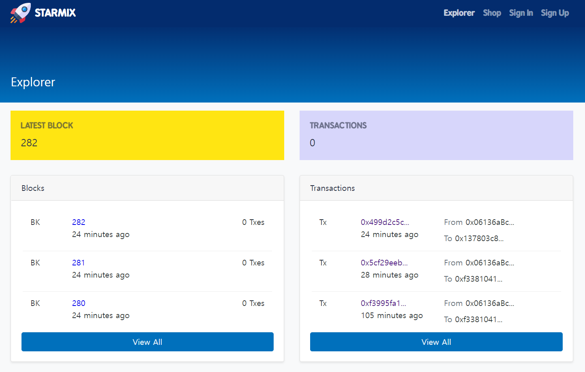

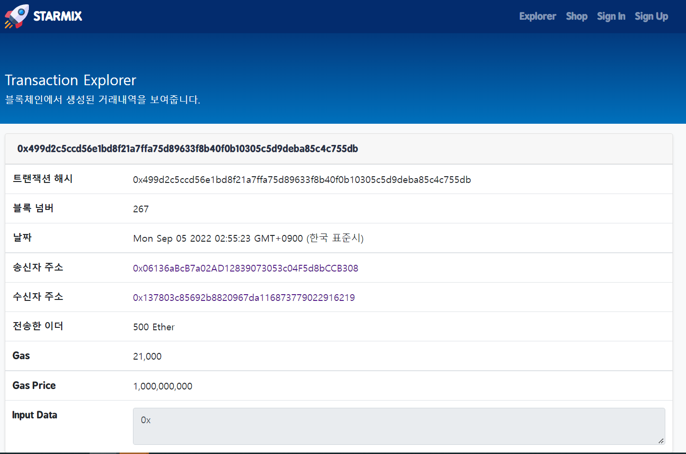
